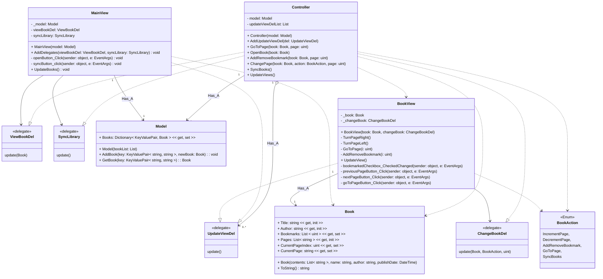

```mermaid
classDiagram
class Controller{
    - model: Model
    - updateViewDelList: List<UpdateViewDel>
    + Controller(model: Model)
    + AddUpdateViewDel(del: UpdateViewDel) 
    + GoToPage(book: Book, page: uint) 
    + OpenBook(book: Book) 
    + AddRemoveBookmark(book: Book, page: uint) 
    + ChangePage(book: Book, action: BookAction, page: uint) 
    + SyncBooks() 
    + UpdateViews() 
}

class BookAction {
  <<Enum>>
  IncrementPage,
  DecrementPage,
  AddRemoveBookmark,
  GoToPage,
  SyncBooks
}

class ChangeBookDel {
  <<delegate>>
  update(Book, BookAction, uint)
}

class UpdateViewDel {
  <<delegate>>
  update()
}

class ViewBookDel {
  <<delegate>>
  update(Book)
}

class SyncLibrary {
  <<delegate>>
  update()
}

class Book{
    + Title: string << get, init >>
    + Author: string << get, init >>
    + Bookmarks: List < uint > << get, set >>
    + Pages: List< string > << get, init >>
    + CurrentPageIndex: uint << get, set >>
    + CurrentPage: string << get, set >>
    + Book(contents: List< string >, name: string, author: string, publishDate: DateTime)
    + ToString() string
}

class Model{
    + Books: Dictionary< KeyValuePair<string, string>, Book > << get, set >>
    + Model(bookList: List<Book>)
    + AddBook(key: KeyValuePair< string, string >, newBook: Book): void
    + GetBook(key: KeyValuePair< string, string >): Book
}

class BookView{
    - _book: Book
    - _changeBook: ChangeBookDel
    + BookView(book: Book, changeBook: ChangeBookDel)
    - TurnPageRight()
    - TurnPageLeft()
    - GoToPage(i: uint)
    - AddRemoveBookmark(i: uint)
    + UpdateView()
    - bookmarkedCheckbox_CheckedChanged(sender: object, e: EventArgs)
    - previousPageButton_Click(sender: object, e: EventArgs)
    - nextPageButton_Click(sender: object, e: EventArgs)
    - goToPageButton_Click(sender: object, e: EventArgs)
}

class MainView{
    - _model: Model
    - viewBookDel: ViewBookDel
    - syncLibrary: SyncLibrary
    + MainView(model: Model)
    + AddDelegates(viewBookDel: ViewBookDel, syncLibrary: SyncLibrary) void
    - openButton_Click(sender: object, e: EventArgs) void
    - syncButton_click(sender: object, e: EventArgs) void
    + UpdateBooks() void
}

Controller "1" --> "1" Model : Has_A
Controller ..|> ChangeBookDel
Controller "1" o--> "0..*" UpdateViewDel : Has_A
Controller ..> Book
Controller ..> BookAction
Controller ..> BookView
Controller ..|> ViewBookDel
Controller ..|> SyncLibrary
MainView --> ViewBookDel
MainView --> SyncLibrary
MainView "1" --> "1" Model : Has_A
MainView ..> Book
MainView ..|> UpdateViewDel
BookView ..|> UpdateViewDel
BookView "1" --> "1" Book : Has_A
BookView --> ChangeBookDel
BookView ..> BookAction
```
